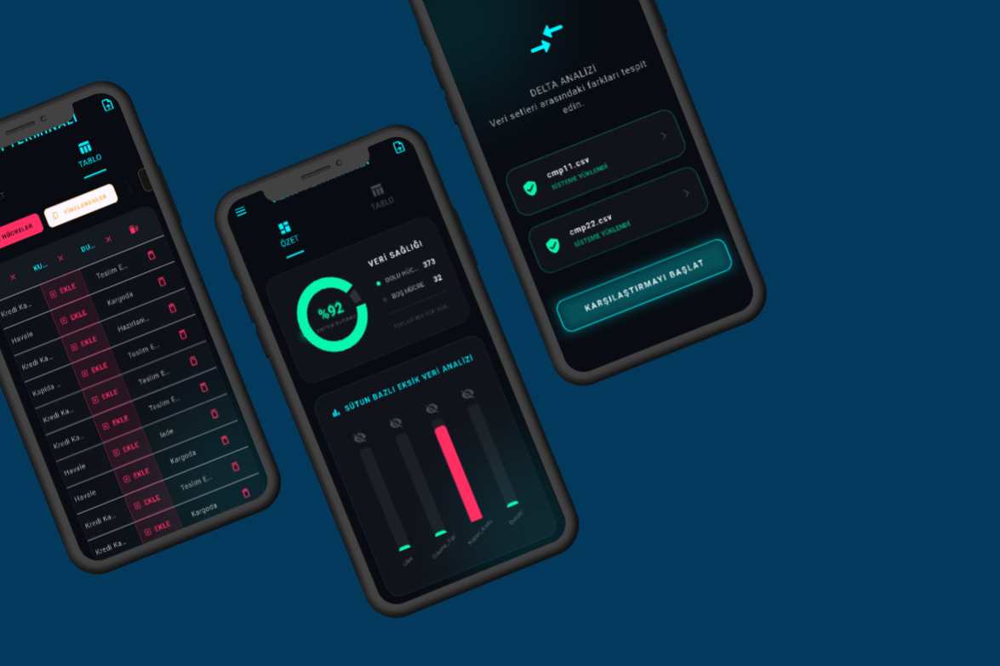

<div align="center" style="position: relative; text-align: center; color: white;">
    <div style="position: absolute; top: 50%; left: 50%; transform: translate(-50%, -50%); width: 90%; padding: 20px; background-color: rgba(0, 0, 0, 0.6); border-radius: 20px; backdrop-filter: blur(8px);">
        <h1 style="color: white; font-size: 3.5vw; font-weight: bold; margin-bottom: 10px; text-shadow: 2px 2px 8px rgba(0,0,0,0.7);">📊 CSV Quick Stats</h1>
        <p style="color: #f8f8f8; font-size: 1.8vw; font-weight: 500; text-shadow: 1px 1px 4px rgba(0,0,0,0.7);">Analyze data, extract insights, master your datasets.</p>
    </div>
    
</div>

<br>

**CSV Quick Stats** is a high-performance data management terminal developed with **Flutter**, designed to analyze complex datasets in seconds, extract core statistics, and perform structural comparisons between data files.

Unlike standard spreadsheet tools, **CSV Quick Stats** focuses on data "health." It processes heavy data manipulation algorithms in the background without freezing the UI, offers a modern **Glassmorphism** design language, and securely processes all your data entirely on your local device.

---

## ✨ Key Features

CSV Quick Stats is not just a utility; it is a reflection of modern software engineering principles.

### 🧠 Intelligent Data Analysis
* **Statistical Engine:** Automatically calculates column-based unique values, averages, min/max ranges, and identifies data types.
* **Data Health Audit:** * **Empty Cell Detection:** Instantly identifies missing data and visualizes it with cyber-red highlights.
    * **Duplicate Detection:** Mathematically analyzes duplicate rows and provides options for data cleaning.
* **Dynamic Comparison:** Structural comparison between different datasets with instant reporting of discrepancies.

### 🔄 Interactive Data Management
* **In-Place Editing:** Real-time, cell-based data updates directly through the table interface.
* **Structural Operations:** Dynamically delete unnecessary columns and rows to streamline your data.
* **Export Capability:** Save analyzed, cleaned, and edited data back into standard CSV format.

### 💎 Modern UI/UX Architecture
* **Glassmorphism Design:** A futuristic interface crafted with translucent panels, blur effects, and deep gradients.
* **Cyber-Terminal Aesthetics:** A high-contrast dark mode theme optimized for data-centric workflows.
* **Fluid Performance:** Heavy computational tasks run independently from the main thread, ensuring 60 FPS smooth animations and a lag-free table experience.

---

## 🛠️ Technologies and Packages Used

This project was developed with **Flutter** and **Dart**, adhering to clean code principles and strict engineering standards.

* **Framework:** [Flutter](https://flutter.dev/) (Dart 3.x)
* **State Management:** `flutter_bloc` / `cubit` (Predictable & Scalable)
* **Data Processing:** `csv` parser engine
* **UI/UX Components:** `data_table_2` (Advanced Table UI), `lottie` (Vector Animations)
* **Architecture:** Clean Architecture & SOLID Principles

---

## 🚀 Installation and Setup

Follow the steps below to run this project on your local machine:

**Prerequisites:** You must have the [Flutter SDK](https://docs.flutter.dev/get-started/install) installed.

1.  **Clone the Project:**
    ```bash
    git clone https://github.com/UnalPilavci/CSV_Quick_Stats_V1.git
    ```

2.  **Enter the Project Directory:**
    ```bash
    cd csv_quick_stats
    ```

3.  **Install Dependencies:**
    ```bash
    flutter pub get
    ```

4.  **Run the Application:**
    ```bash
    flutter run
    ```

---

## 👨‍💻 Developer

This project was developed by **Ünal Pilavcı**.

<div align="center">
  <a href="https://www.linkedin.com/in/%C3%BCnal-p-a7bb2a24a/" target="_blank">
    
  </a>
  <a href="https://github.com/UnalPilavci" target="_blank">
    
  </a>
  <a href="mailto:unal.plvc38@gmail.com">
    
  </a>
</div>

---

This project was developed with ❤️ and Engineering Passion. If you find it useful, feel free to support us by leaving a Star (⭐)!
